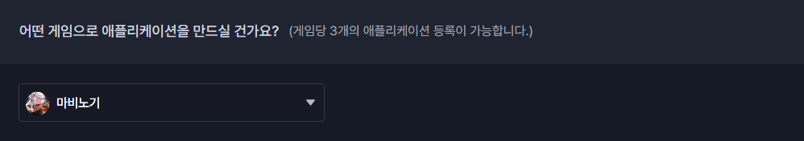
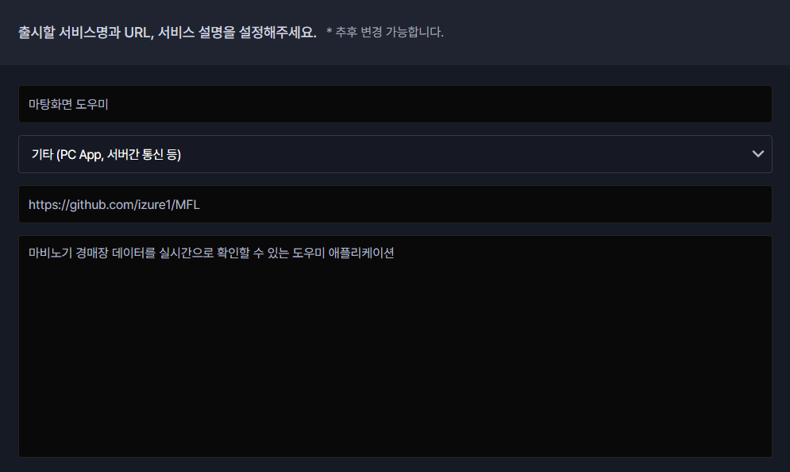
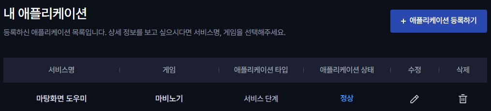

# 마탕화면 도우미 API 키 발급 및 설정 가이드

'마탕화면 도우미' 애플리케이션의 경매장 기능을 사용하려면, Nexon OpenAPI에서 개인 API 키를 발급받아야 합니다. 아래의 단계를 따라 API 키를 직접 발급받고, 발급된 키를 애플리케이션에 입력하세요.

## 1. Nexon OpenAPI에서 애플리케이션 등록하기

1. **Nexon OpenAPI 접속**
   - [Nexon OpenAPI](https://openapi.nexon.com/ko/my-application/create-app/)에 접속합니다.

2. **Nexon 계정으로 로그인**
   - Nexon 계정이 없다면 회원가입 후 로그인하세요.

3. **애플리케이션 등록**
   - 로그인 후 애플리케이션 등록 페이지에서 아래 정보를 입력합니다.
   
     - **어떤 게임으로 애플리케이션을 만드실 건가요?**: **마비노기**를 선택합니다.

     

     - **애플리케이션 타입**: 드롭다운 목록에서 **서비스 단계**를 선택합니다.
       - 선택 후, 추가적으로 서비스 이름, URL, 서비스 설명을 입력합니다.

     

       - **서비스명**: `마탕화면 도우미`
       - **개발 환경**: `기타`
       - **서비스 URL**: `https://github.com/izure1/MFL`
       - **서비스 설명**: `마비노기 경매장 데이터를 실시간으로 확인할 수 있는 도우미 애플리케이션`

4. **애플리케이션 등록 완료**
   - 입력을 완료한 후 **등록** 버튼을 눌러 애플리케이션을 등록합니다.

## 2. API 키 발급받기

1. **등록된 애플리케이션 확인**
   - [Nexon OpenAPI 내 애플리케이션](https://openapi.nexon.com/ko/my-application/) 페이지에서 방금 등록한 애플리케이션을 확인합니다.

   

2. **API 키 얻기**
   - 등록된 애플리케이션을 선택한 후, **API 키**를 확인하고 복사합니다.

## 3. 마탕화면 도우미에 API 키 입력하기

1. **마탕화면 도우미 실행**
   - 애플리케이션을 실행합니다.

2. **API 키 입력**
   - 설정 메뉴에서 **API 키 입력**란에 Nexon OpenAPI에서 발급받은 **API 키**를 입력합니다.

3. **저장 및 확인**
   - API 키 입력 후, 저장하여 경매장 기능을 활성화합니다.

## 4. 주의사항

- 발급받은 API 키는 개인용이므로 외부에 노출되지 않도록 주의하세요.
- API 키가 잘못 입력되면 경매장 기능을 사용할 수 없으니 정확하게 입력하세요.

---

이 가이드를 따라 Nexon OpenAPI에서 API 키를 발급받고 '마탕화면 도우미' 애플리케이션에서 경매장 기능을 이용할 수 있습니다. 궁금한 점이 있다면 문의해 주세요.
